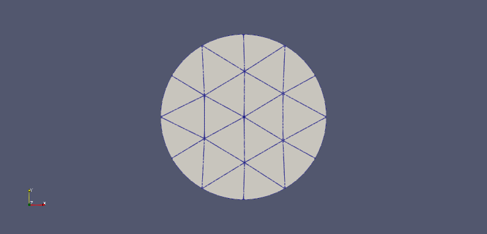

This is currently just about getting simple curved meshes working in Firedrake.

The example in test_circle was meshed using the command:

gmsh -2 test_circle.geo -order 2

The example test_circle_straight.msh does not include curved elements.

The script test_netgen.py includes very basic tests of NetGen integration in Firedrake.  It also can be used to show that Firedrake does not succcessfully load a Netgen .vol file converted from a Gmsh .msh file with curved edges in a 2D mesh.

The file test_ngmsh2.vol is a saved Netgen mehs file that reads successfully into Firedrake and can be used to construct a quadratic curved mesh (see script, and compare e.g. test_circle.vol that is a mesh ported to Netgen by meshio and which doesn't work - maybe due to missing edgesegmentsgi2?).

N.B. to see the curved edges in ParaView, increase the Nonlinear Subdivision Level parameter.

